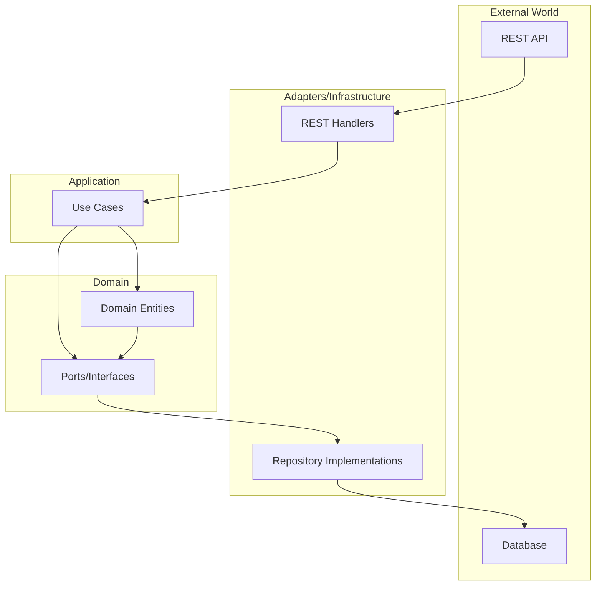
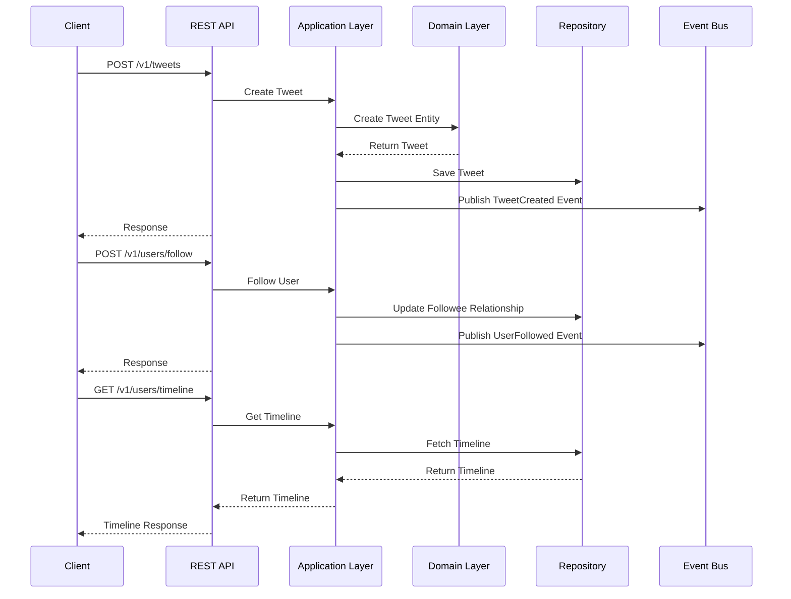
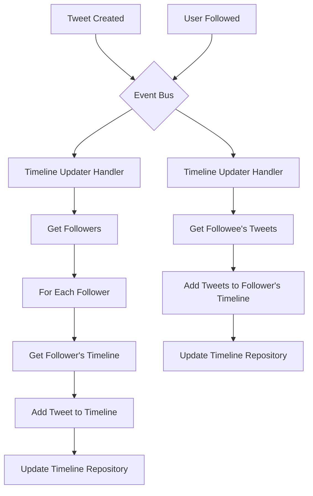

# A Simplified Microblogging Backend

This project is a backend implementation for a simplified microblogging platform, similar to Twitter, as part of the Ualá technical challenge.  It allows users to post tweets, follow other users, and view timelines.

## Table of Contents

- [Features](#features)
- [Architecture](#architecture)
- [Flow Diagrams](#flow-diagrams)
    - [Hexagonal Architecture](#hexagonal-architecture)
    - [User Interaction Flow](#user-interaction-flow)
    - [Timeline Generation](#timeline-generation)
- [API Endpoints](#api-endpoints)
- [Technologies Used](#technologies-used)
- [Project Structure](#project-structure)
- [Setup and Running](#setup-and-running)
    - [Prerequisites](#prerequisites)
    - [Running Locally (In-Memory Version)](#running-locally-in-memory-version)
    - [Running with Docker Compose](#running-with-docker-compose)
- [Logging and Monitoring](#logging-and-monitoring)
    - [Components](#components)
    - [Features](#features)
    - [Accessing Logs](#accessing-logs)
- [Testing](#testing)

## Features

* **Post Tweets**: Users can publish short messages (up to 280 characters).
* **Follow Users**: Users can follow other users to see their tweets.
* **View Timeline**: Users can view a timeline of tweets from users they follow, optimized for reads.

## Architecture

The system uses a **Hexagonal Architecture (Ports and Adapters)** to ensure a clean separation of concerns.

### High-Level Architecture Overview

This project implements a Hexagonal Architecture (also known as Ports and Adapters) pattern, which separates the core business logic from external concerns. The architecture consists of three main layers:

1. **Domain Layer**: Contains the core business entities, logic, and interfaces (ports)
2. **Application Layer**: Orchestrates the domain objects to fulfill use cases
3. **Infrastructure Layer**: Implements the interfaces defined in the domain layer (adapters)

## Flow Diagrams

### Hexagonal Architecture



### User Interaction Flow



### Timeline Generation



## API Endpoints

* `POST /v1/tweets`
    * Header: `X-User-ID: <author_user_id>`
    * Body: `{"tweetId": "string", "content": "string"}`
* `POST /v1/users/follow`
    * Header: `X-User-ID: <follower_user_id>`
    * Body: `{"followeeId": "string"}`
* `POST /v1/users/unfollow`
    * Header: `X-User-ID: <follower_user_id>`
    * Body: `{"unFolloweeId": "string"}`
* `GET /v1/users/timeline`
    * Header: `X-User-ID: <user_id>`
* `POST /v1/users`
    * Body: `{"userId": "string"}`

## Technologies Used

* **Language**: Golang
* **Containerization**: Docker
* **Logging & Monitoring**: Grafana, Loki, Promtail
* **(Development)**: In-memory data stores.

## Project Structure

This project follows a clean and modular structure based on hexagonal architecture principles:

* `/cmd/api`: Entry point for the application, contains main.go and server initialization
* `/internal`: Core application code isn't meant to be imported by external projects
  * `/domain`: Contains core business logic, entities, and domain interfaces (ports)
  * `/application`: Application services that orchestrate domain objects to fulfill use cases
  * `/infrastructure`: Implementations of the domain interfaces (adapters) including repositories and external services
* `/pkg`: Reusable packages that could be imported by other projects
* `Dockerfile`: Container definition for production deployment
* `Makefile`: Common commands for building, testing, and running the application

This structure separates business logic from technical implementations, making the codebase more maintainable and testable.

## Setup and Running

### Prerequisites

* Go (version 1.23.9)
* Docker
* Docker Compose

### Running Locally (In-Memory Version)

```bash
cd microblogging
make run
```

### Running with Docker Compose

To run the application with Docker Compose, which includes Grafana and Loki for log monitoring:

```bash
make docker-compose-up
```

This will start the following services:
- Microblog application (http://localhost:8080)
- Grafana (http://localhost:3000) - Use admin/admin for login
- Loki (http://localhost:3100)
- Promtail (for log collection)

To stop all services:

```bash
make docker-compose-down
```

## Logging and Monitoring

This project includes a comprehensive logging and monitoring setup using Grafana and Loki:

### Components

- **Loki**: A horizontally-scalable, highly-available log aggregation system
- **Promtail**: An agent that ships the contents of local logs to Loki
- **Grafana**: A visualization and analytics platform for monitoring and observability

### Features

- Centralized log collection from all containers
- Pre-configured Grafana dashboards for log visualization
- Real-time log monitoring
- Log filtering and searching capabilities
- Log level distribution visualization
- Error count monitoring

### Accessing Logs

1. Start the services with `make docker-compose-up`
2. Open Grafana at http://localhost:3000 (login with admin/admin)
3. Navigate to the "Microblog Logs" dashboard
4. View and search logs in real-time
